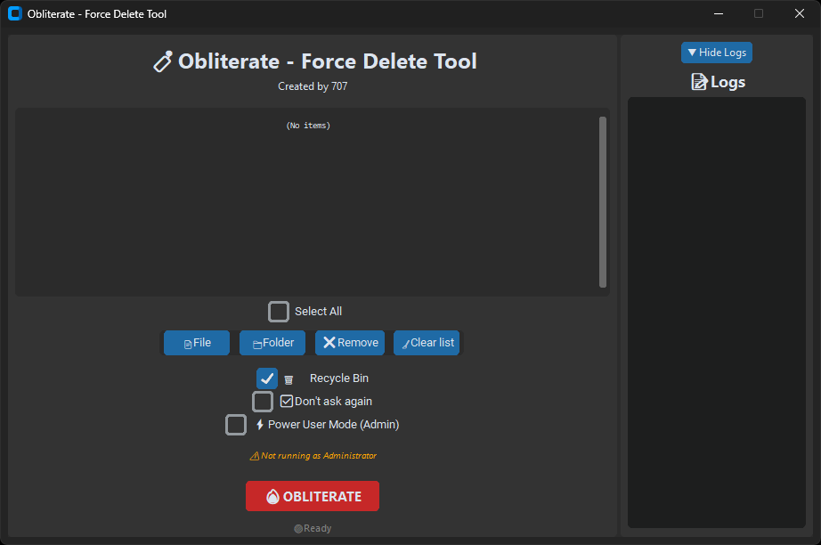

# 🧨 Obliterate

**Obliterate** is a sleek and powerful desktop app for forcefully deleting files and folders — even those locked, in-use, or system protected. Designed for Windows users who need real deletion control with a beautiful dark GUI.

Built with [CustomTkinter](https://github.com/TomSchimansky/CustomTkinter) and powered by PowerShell for fallback deletion.

## 📷 Screenshot




---

## 🚀 Features

✅ File/folder selection with checkboxes  
✅ Delete to Recycle Bin or permanently  
✅ Force delete locked or in-use files using PowerShell  
✅ Admin manifest support (run as admin for full access)  
✅ Collapsible logs panel with clear output  
✅ Sleek, compact dark-themed interface  
✅ Created by [707](https://github.com/707io)

---

## 🧪 How to Use

### 💻 Run from Source

```bash
git clone https://github.com/707io/obliterate
cd obliterate
pip install -r requirements.txt
python main.py
```

> Python 3.10+ required

---

### 🧾 Run as a Standalone EXE

Download [`Obliterate.exe`](https://github.com/707io/obliterate-app/releases/latest) and run it directly.

> ⚠ You may need to **run as Administrator** to delete locked/system files.

---

## 📂 Files Included

| File               | Description                                         |
|--------------------|-----------------------------------------------------|
| `main.py`          | Source code for the GUI app                         |
| `admin.manifest`   | Elevation manifest file to request admin privileges |
| `requirements.txt` | Python dependencies needed to run the app           |
| `Obliterate.exe`   | Compiled standalone executable (Windows only)       |

---

## ⚙ Building Your Own EXE

Install dependencies and use PyInstaller:

```bash
pip install customtkinter send2trash pyinstaller
pyinstaller --noconsole --onefile --icon=icon.ico --manifest=admin.manifest main.py
```

---

## 📜 License

MIT License © [707](https://github.com/707io)

---

## 💬 Feedback or Suggestions?

Feel free to open an issue or PR! Contributions are welcome.
